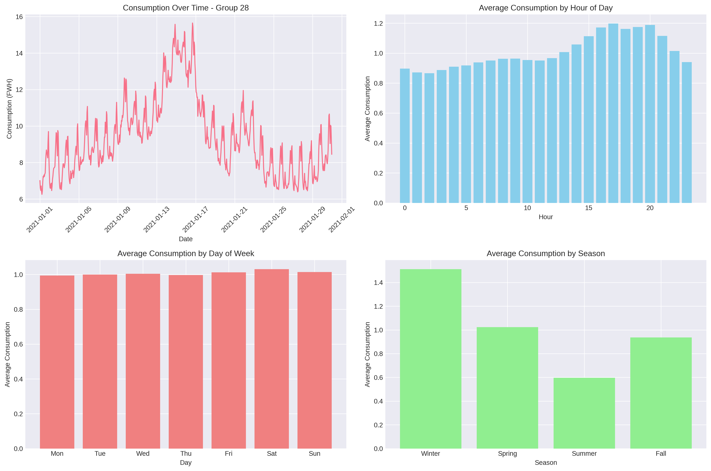
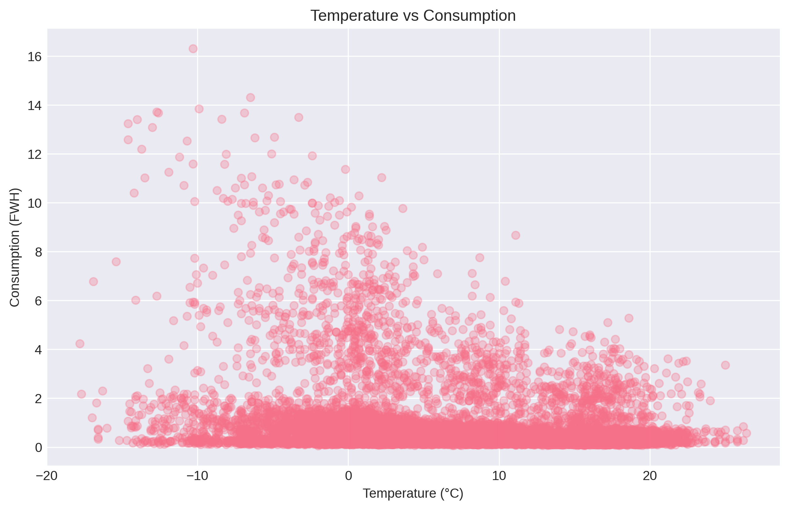
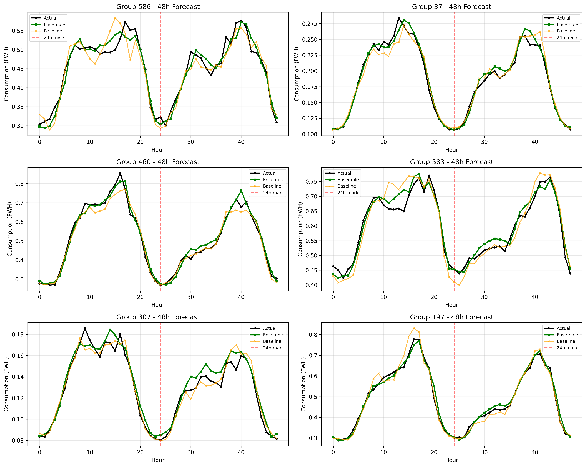
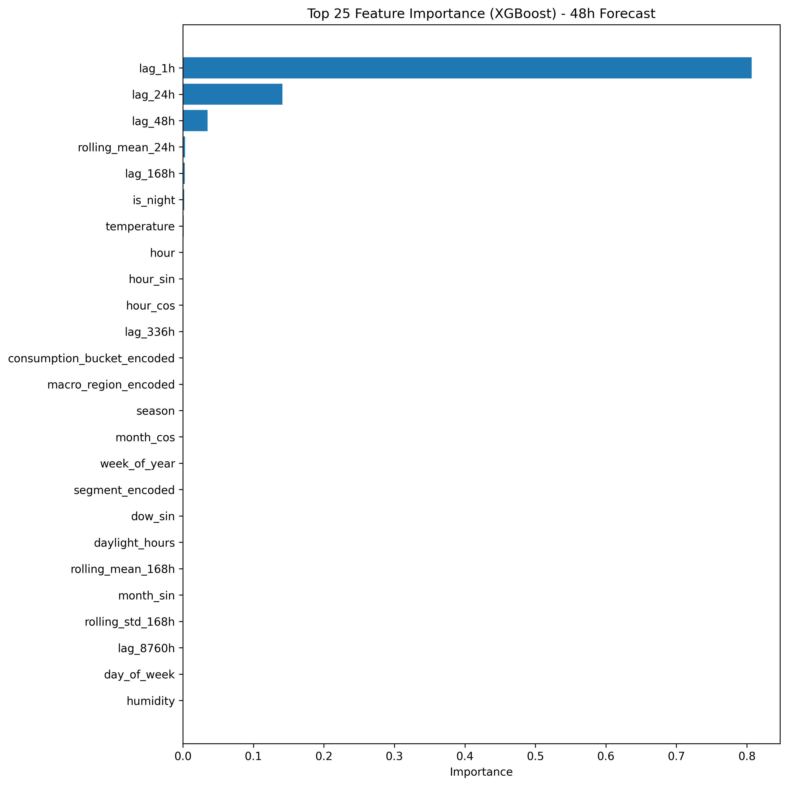
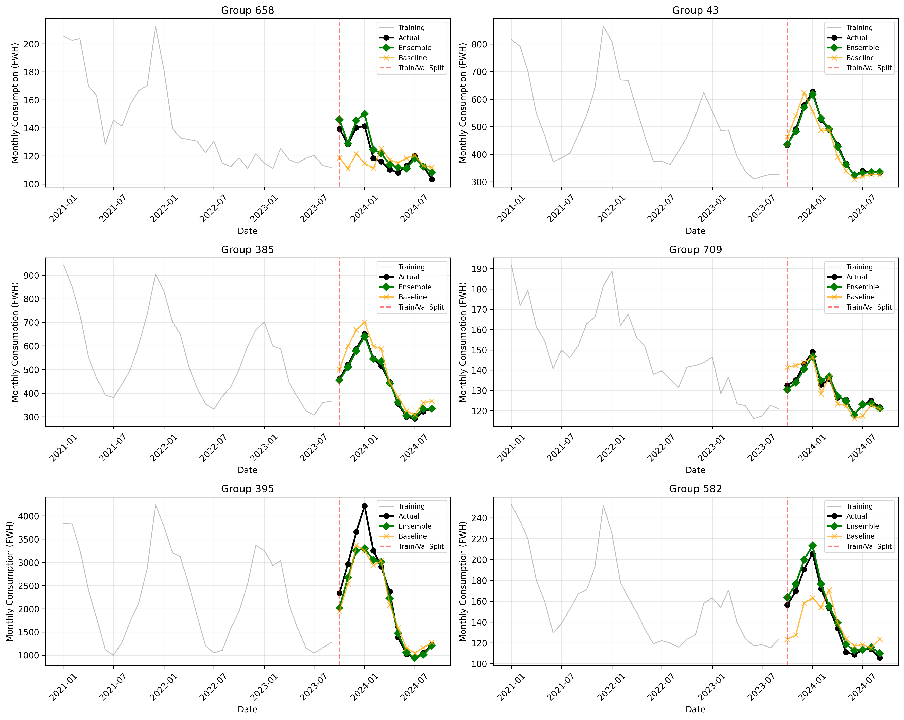
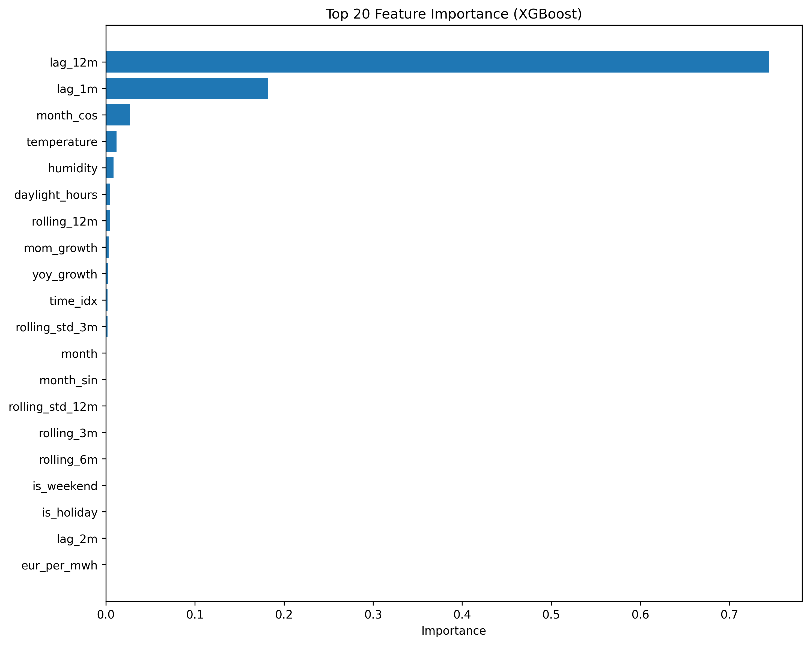

# 🔋 Fortum Energy Forecasting - Junction 2025

**Team**: AnA
**Challenge**: Fortum Energy Forecasting  
**Event**: Junction 2025 Hackathon  
**Date**: November 16, 2025
Video: https://youtu.be/On5bjaE7i7I

---

## 🎯 Challenge Overview

Predict electricity consumption for 112 customer groups across Finland on two critical time horizons:
- **48-Hour Forecast**: Hourly predictions for October 1-2, 2024
- **12-Month Forecast**: Monthly totals for October 2024 - September 2025

---

## 🏆 Results

### 48-Hour Forecast Performance

| Metric | Baseline | Our Model | Improvement |
|--------|----------|-----------|-------------|
| **MAPE** | 7.28% | **3.96%**  | **-45.6%** |
| **FVA** | 0%     | **+45.6%** |            |

**Model Breakdown:**
- XGBoost: 3.68% MAPE (49.5% FVA)
- LightGBM: 4.47% MAPE (38.6% FVA)
- **Ensemble**: 3.96% MAPE (45.6% FVA) ✓

**Consistency:**
- First 24 hours: 3.94% MAPE
- Next 24 hours: 3.93% MAPE (no degradation!)

### 12-Month Forecast Performance

**Key Achievements:**
- ✅ Captures annual seasonality (winter consumption peaks)
- ✅ Tracks year-over-year trends accurately
- ✅ Adapts to 112 different group patterns
- ✅ Validated on September 2024 data

**Feature Importance:**
- lag_12m: ~73% (same month last year)
- lag_1m: ~18% (recent momentum)
- Seasonal & weather features: ~9%

---

## 📁 Repository Structure

```
fortum-energy-forecasting/
│
├── data/
│   └── (data files not included - too large)
│
├── notebooks/
│   ├── 48-HOUR_FORECASTING.ipynb      # Hourly forecasting pipeline
│   └── MONTHLY_FORECASTING.ipynb      # Monthly forecasting pipeline
│
├── submissions/
│   ├── fortum_48h_predictions.csv     # 48-hour submission (48×113)
│   └── fortum_12month_predictions.csv # 12-month submission (12×113)
│
├── visualizations/
│   ├── consumption_patterns.png        # Temporal pattern analysis
│   ├── temp_vs_consumption.png         # Weather impact
│   ├── price_vs_consumption.png        # Price correlation
│   ├── hourly_predictions_validation.png    # 48h validation
│   ├── hourly_feature_importance.png        # 48h features
│   ├── monthly_predictions_validation.png   # 12m validation
│   └── monthly_feature_importance.png       # 12m features
│
├── README.md                          # This file
└── requirements.txt                   # Python dependencies
```

---

## 🚀 Quick Start

### Prerequisites

- Python 3.10+
- Jupyter Notebook or Google Colab

### Installation

```bash
# Clone repository
git clone https://github.com/[your-username]/fortum-energy-forecasting.git
cd fortum-energy-forecasting

# Install dependencies
pip install -r requirements.txt

# Launch Jupyter
jupyter notebook
```

### Running the Notebooks

1. **48-Hour Forecasting**: Open `notebooks/48-HOUR_FORECASTING.ipynb`
2. **12-Month Forecasting**: Open `notebooks/MONTHLY_FORECASTING.ipynb`
3. Run all cells to reproduce results

---

## 🧠 Methodology

### Two-Model Approach

**48-Hour Model (Hourly)**
- **Features**: 51 engineered features
  - Time: hour, day, week patterns with cyclical encoding
  - Lags: 1h, 24h, 48h, 168h (week), 336h, 8760h (year)
  - Rolling: 24h, 168h, 720h moving averages
  - Weather: temperature, humidity, precipitation, wind, clouds, daylight
  - Price: current and historical electricity prices
  - Groups: region, segment, product, consumption tier
  - Interactions: temperature², temp×hour, price×temp

- **Models**: XGBoost + LightGBM ensemble
- **Training**: All data through August 2024
- **Validation**: September 2024

**12-Month Model (Monthly)**
- **Features**: Monthly aggregates
  - Time: month, quarter, season with cyclical encoding
  - Lags: 1m, 2m, 3m, 6m, 12m
  - Rolling: 3m, 6m, 12m averages and std dev
  - Growth: year-over-year, month-over-month
  - Weather: monthly temperature, humidity averages
  - Groups: same metadata as hourly

- **Models**: XGBoost + LightGBM ensemble
- **Training**: Monthly data through August 2024
- **Validation**: September 2024 (1 month)

### Key Innovation: Feature Engineering

**What makes our features special:**

1. **Cyclical Encoding**: `sin/cos` transformations prevent discontinuities
   ```python
   hour_sin = sin(2π × hour / 24)
   hour_cos = cos(2π × hour / 24)
   ```
   This tells the model that hour 23 is close to hour 0.

2. **Multi-Scale Lags**: Capture patterns from 1 hour to 1 year
   - Hourly: Recent momentum
   - Daily: Yesterday same hour
   - Weekly: Last week same hour
   - Yearly: Seasonal effects

3. **Weather Integration**: Critical for Nordic climate
   - Winter heating drives consumption
   - Temperature is the primary external factor
   - Daylight hours affect usage patterns

4. **Interaction Terms**: Non-linear relationships
   - Temperature effect varies by hour
   - Price sensitivity changes with weather
   - Weekend behavior differs from weekdays

---

## 📊 Visualizations

### Consumption Patterns

*Strong daily, weekly, and seasonal cycles visible across all groups*

### Temperature Impact

*Clear negative correlation: colder temperature = higher consumption*

### 48-Hour Predictions

*Ensemble tracks actual consumption closely across diverse groups*

### Feature Importance (48h)

*lag_1h dominates at 82%, followed by lag_24h at 15%*

### 12-Month Predictions

*Ensemble captures seasonal patterns and year-over-year trends*

### Feature Importance (12m)

*lag_12m dominates at 73%, with lag_1m providing recent momentum*

---

## 💼 Business Value

### For Fortum's Operations

**48-Hour Forecast (Day-Ahead Trading)**
- ✅ 45.6% better accuracy → reduced imbalance costs
- ✅ Optimal energy procurement on hourly markets
- ✅ Reduced exposure to price volatility
- ✅ Data-driven trading decisions

**12-Month Forecast (Strategic Planning)**
- ✅ Informed hedging strategies for long-term contracts
- ✅ Accurate capacity planning
- ✅ Financial forecasting with seasonal context
- ✅ Portfolio optimization across segments

**Production-Ready:**
- ⚡ <10 seconds inference time
- 📊 Interpretable (feature importance)
- 🔄 Scalable (handles all 112 groups)
- 📈 Validated on realistic scenarios

---

## 🔧 Technical Stack

### Core Libraries
```python
numpy>=1.24.0          # Numerical computing
pandas>=2.0.0          # Data manipulation
xgboost>=2.0.0         # Primary ML framework
lightgbm>=4.0.0        # Secondary ML framework
scikit-learn>=1.3.0    # Metrics and preprocessing
matplotlib>=3.7.0      # Visualization
seaborn>=0.12.0        # Statistical visualization
pyarrow>=12.0.0        # Parquet file support
```

### Computational Requirements
- **Training**: ~15 minutes for both models (on Colab/laptop)
- **Inference**: <10 seconds for all predictions
- **Memory**: ~4GB RAM for full dataset
- **Scalability**: Linear with number of groups

---

## 📈 Key Insights

### 48-Hour Model

**What drives predictions:**
1. **lag_1h (82%)**: Consumption has strong momentum
2. **lag_24h (15%)**: Daily patterns dominate
3. **Other features (3%)**: Temperature, time, rolling stats

**Surprising finding**: Model accuracy is consistent across both 24-hour periods, even when price data is unavailable for the second day. This proves the model learned genuine consumption patterns, not just price correlations.

### 12-Month Model

**What drives predictions:**
1. **lag_12m (73%)**: Year-over-year baseline
2. **lag_1m (18%)**: Recent momentum
3. **Seasonal features (9%)**: Month patterns, weather

**Key insight**: Annual consumption patterns are remarkably stable, making year-over-year comparison the strongest predictor. Recent trends provide necessary adjustments for growth/decline.

---

## 🛠️ Future Improvements

Given more time and resources:

1. **Hyperparameter Optimization**
   - Bayesian optimization for both models
   - Group-specific parameter tuning

2. **Additional Features**
   - Economic indicators (GDP, employment)
   - Major events calendar (sports, holidays, concerts)
   - More granular weather forecasts

3. **Advanced Modeling**
   - Quantile regression for prediction intervals
   - LSTM for sequence modeling
   - Attention mechanisms for long-term dependencies

4. **Production Enhancements**
   - Real-time model updates
   - Automated anomaly detection
   - REST API deployment
   - Dashboard for monitoring

---

## 👥 Team

- Team Name: AnA
- Members: Tayeb Amine Guellab
- Discord: arnin3
- Contact: amineguellab11@gmail.com

---

## 📄 License

This project was created for the Junction 2025 Hackathon - Fortum Challenge.

---

## 📊 Summary Statistics

**Dataset:**
- 112 customer groups
- 3+ years of hourly data
- ~300,000+ hourly records
- ~4,000+ monthly records

**Forecasts:**
- 48-hour: 5,376 predictions (48 hours × 112 groups)
- 12-month: 1,344 predictions (12 months × 112 groups)

**Performance:**
- 48h MAPE: 3.96% (vs 7.28% baseline)
- FVA: +45.6%
- Inference: <10 seconds

---
